Optisplat
================

**University of Pennsylvania, CIS 565: GPU Programming and Architecture, Final Project**

* Rahul Aggarwal, Josh Smith, Mile Rabbitz
  * Linkedins [TODO] ...
* Tested on: Ubuntu 20.04 x86_64, AMD EPYC 7452 32-Core (128) @ 2.35GHz 512GB, NVIDIA RTX A6000 48GB

## Overview (What is optimal splatting?)

This project addresses the inherent limitations of traditional gaussian splatting techniques in rendering 3D scenes. Standard gaussian splatting involves approximating the projection of 3D gaussians into 2D splats using a first order approximation as the perspective transformation for 3D gaussians does not have a closed form. These projection errors degrade the quality of both training and inference in Gaussian splatting-based rendering.

A recent work [1] has proposed an alternative approach to improve the fidelity of Gaussian projections under perspective transformations. Instead of projecting Gaussians onto a flat plane, they propose radially projecting each 3D gaussian based on its mean along a line that connects it directly to the camera center. The projection lands each Gaussian on a plane tangent to the unit sphere and perpendicular to the projection line.

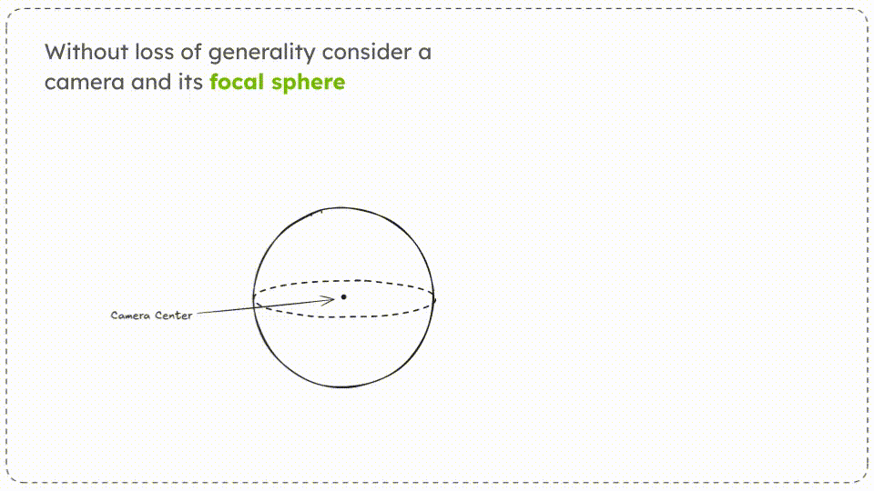

## Objectives (What are we aiming to achieve?)

We aim to make the following key contributions:

- [x] **Optimize Optimal Gaussian Splatting**. Currently, the baseline performance of optimal gaussian splatting when compared to the original implementation is a 3x *slowdown.* We aim to improve performance on optimal gaussian splatting by 66% by writing custom CUDA parallel code for both the forward and backward passes.

- [ ] **Write the novel fisheye camera** forward and backward passes, making it possible to train and render gaussian splats directly from fisheye lenses. This will involve deriving the gradient between the local tangent plane and the image plane projections.

- [x] **Provide the first 360 degree camera gaussian splatting SLAM implementation**. Gaussian splatting SLAM has been done before with narrow FOV, pinhole cameras. However, 360 degree cameras offer a major challenge as they have a much wider FOV, which causes traditional gaussian splatting SLAM implementations to fail. Additionally, we have to deal with a different camera model, which we aim to first solve through rectification, and then through our fisheye implementation.


## Optisplat Installation

Clone the repository and create an anaconda environment using

```shell
git clone https://github.com/rahulaggarwal965/cis5650-final-project.git
cd cis5650-final-project

SET DISTUTILS_USE_SDK=1 # Windows only
conda env create --file environment.yml
conda activate optisplat
```

This repository contains support for various camera models: To install them, pick the specified camera model and run the command below. **We recommend starting with the pinhole implementation**.

```shell
# Pinhole
pip install submodules/diff-gaussian-rasterization-pinhole-opt
```

```shell
# Panorama
pip install submodules/diff-gaussian-rasterization-panorama
```

```shell
# Fisheye
pip install submodules/diff-gaussian-rasterization-fisheye-opt
```

## Datasets

### Mip-NeRF 360 Dataset

Please download the data from the [Mip-NeRF 360](https://jonbarron.info/mipnerf360/).

### Tanks & Temples dataset

Please download the data from the [3D Gaussian Splatting](https://repo-sam.inria.fr/fungraph/3d-gaussian-splatting/).

### Deep Blending

Please download the data from the [3D Gaussian Splatting](https://repo-sam.inria.fr/fungraph/3d-gaussian-splatting/).

## Training and Evaluation

By default, the trained models use all available images in the dataset. To train them while withholding a test set for evaluation, use the ```--eval``` flag. This way, you can render training/test sets and produce error metrics as follows:

```shell
python train.py -s <path to COLMAP or NeRF Synthetic dataset> --eval # Train with train/test split
python render.py -m <path to trained model> --fov_ratio 1 # Generate renderings
```

<details>
<summary><span style="font-weight: bold;">Command Line Arguments for render.py</span></summary>

  #### --model_path / -m 
  Path to the trained model directory you want to create renderings for.
  #### --skip_train
  Flag to skip rendering the training set.
  #### --skip_test
  Flag to skip rendering the test set.
  #### --quiet 
  Flag to omit any text written to standard out pipe. 
  #### --fov_ratio
  Focal length reduction ratios.

</details>

## OptiSplat Optimizations

One of our main goals of this project was to make optimal splatting fast enough for it to be feasible to use in a real-time SLAM system. To that end, here are a few optimizations we made. We give a full performance comparison in the summary section below. Additionally, note that forward-pass optimizations affect the backward-pass, but not vice-versa.

### Forward

#### Separated Spherical Harmonics

In the original 3DGS implementation, both the base color (0th SH band) and higher SH bands were merged into a single tensor prior to rasterization, leading to noticeable performance hits during the forward pass. To address this, we've restructured the differential rasterizer to load the Gaussian SH coefficients from separate tensors, streamlining the process and boosting performance.

Since the base color has a significantly higher weight in the color computation, combining it with the other SH bands introduces unnecessary computational overhead.

#### Tangent Plane Preloading

When computing the tangent plane of each gaussian on the unit sphere, we have to do an expensive calculation involving projecting the ray, caculating the spherical coordinates for the ray and assigning a local coordinate frame to the resulting tangent plane. We note that the parallelization scheme for gaussian splatting assigns each *tile* a CUDA block and each *pixel* within a tile a thread. However, this means that each pixel must iterate through each Gaussian, computing the expensive ray intersection each time. Therefore, we implement a caching mechanism that stores the $sin$ and $cos$ of the spherical coordinates (unit length) in shared memory, loaded a warp at a time. This both reduces memory bandwith and computational overhead, which greatly improves performance.

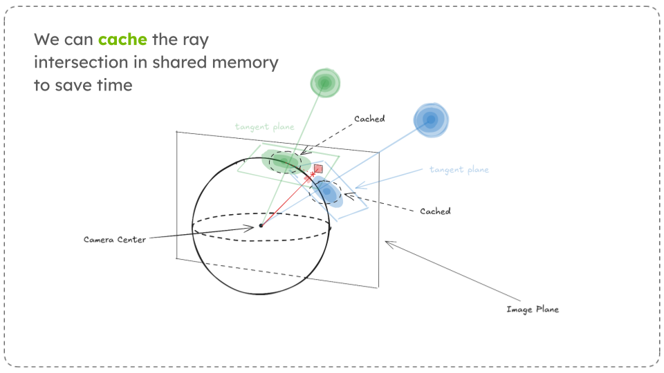

### Backward

#### Sparse Gradient Propagation

During training, we know that each camera can only see a part of the scene. Therefore, we would not like to optimize the paremeters of all the gaussians in the scene. To do so, we may use a [Sparse ADAM](https://pytorch.org/docs/stable/generated/torch.optim.SparseAdam.html) optimizer. and a mask based on whether a Gaussian radius is on-screen or not. However, because of the nature of optimal splatting, gaussians not in view can still have a contribution to the resulting image due to their *tangent-plane contribution*. Therefore, we take this into account when calculating sparsity.

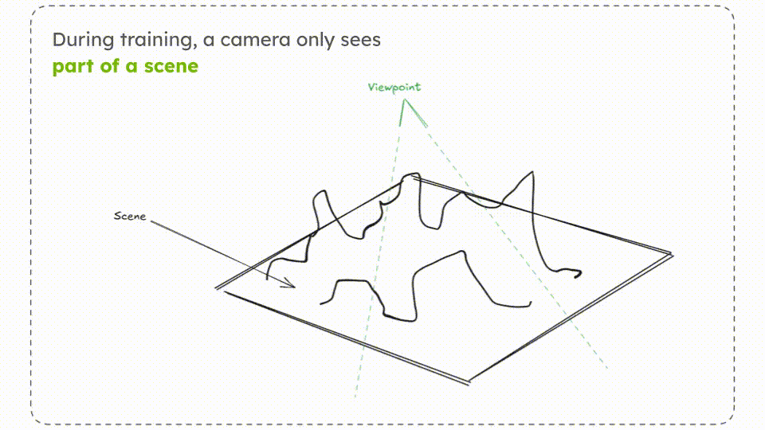

#### Fused SSIM

The Fused SSIM optimization was taken from [2], and involves optimizing the structural similarity index metric, which is used during loss computation. Below, we provide an excerpt from the paper.

>  3DGS loss computation involves evaluating the SSIM metric. It is configured to use 11×11 Gaussian kernel convolu-tion: we propose using optimized CUDA kernels to perform differentiable 2D convolution via two consecutive 1Dconvolutions since Gaussian kernels are separable in nature. In addition, we use a fused kernel for the evaluation of theSSIM metric from the convolved results. This speeds up the loss calculation and is particularly impactful when thenumber of optimized Gaussians is low compared to image resolution, which is the case when training on a budget.

#### Warp-level Gradient Accumulation

TODO (mike):

### Performance Summary

Our performance metrics were tested on a number of scenes, and overall we see a 37% average improvement due to our various optimizations. Below, we provide an analysis of the Bonsai scene to give a specific example of our optimization's performance on a medium size scene. **Note that the following scene is randomly picked**. We display example renderings and performance summar  below.

| fov_ratio | GT                           | Render                                                            |
| --------- | ---------------------------- | ----------------------------------------------------------------- |
| 1         | 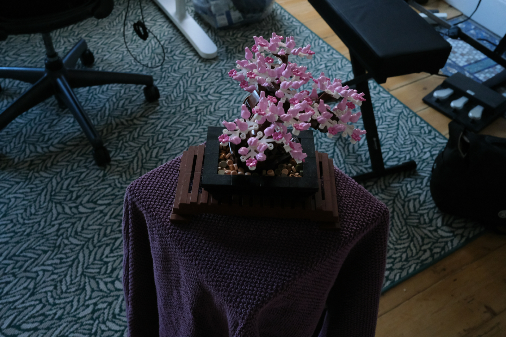 | 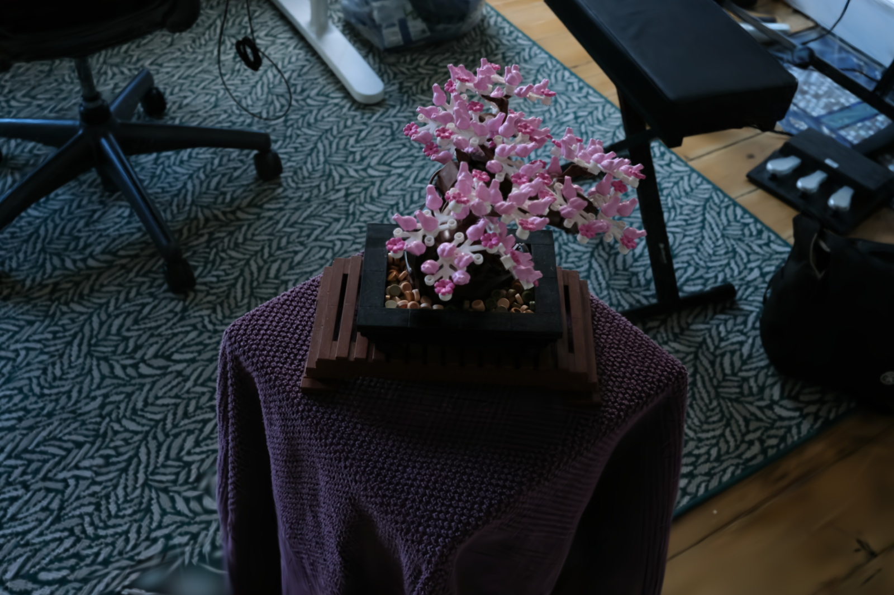   |
| 0.1       |  | 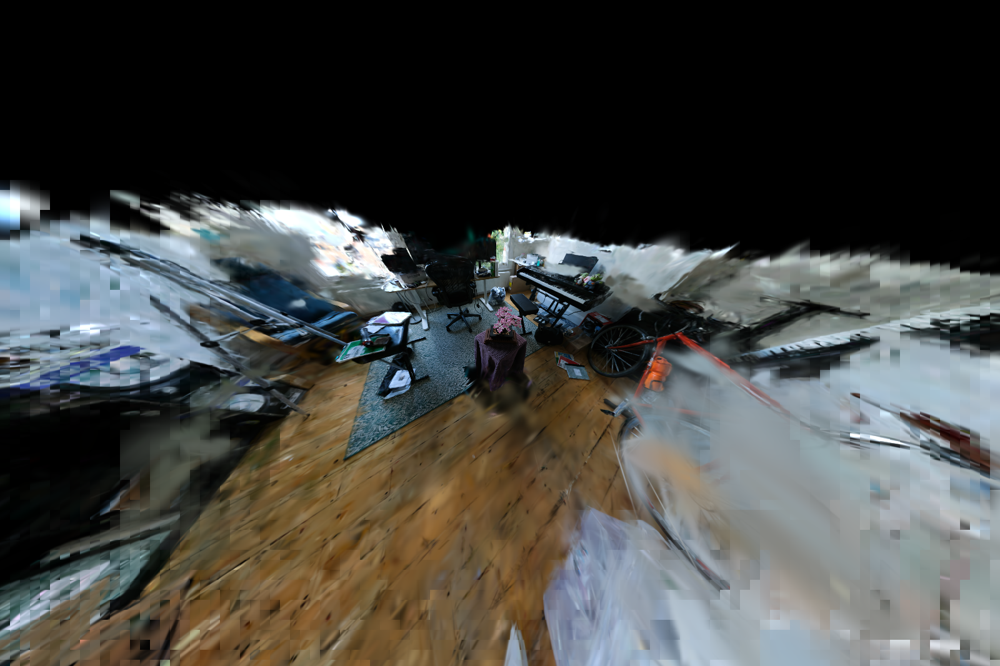 |

Above, we see that our implementation performs quite well even as we increase the FOV, which thereby increases the number of Gaussians that need to be rendered.

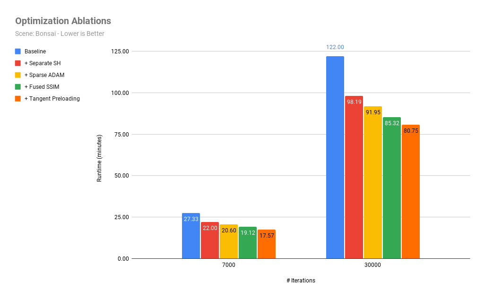

Overall, we see a 37% improvement on the optimization phase of gaussian splatting, especially as we optimize further. We note that the longer the optimization process goes, the number of gaussians increase. However, we see that we also increase in our performance gain, implying that our optimizations perform better for more expensive operations.

We see that the most important optimization is the separating of the spherical harmonic components, which makes sense because it applies to both the forward and backward passes. The Sparse ADAM, Fused SSIM, and tangent preloading all provide smaller (~5%) improvements that add to solid performance.

## Fisheye Camera Model Implementation

Below, we detail our intuition and implementation for our (wip) fisheye camera model implementation.

### Camera Models

The pinhole camera model and the fisheye camera model are two distinct approaches to simulating camera behavior in computer graphics, photography, and optical systems. They differ in how they project the 3D world onto a 2D image plane. Here’s a detailed comparison:

| Aspect              | Pinhole                                                                                                                                                                                                                                                       | Fisheye  (Equidistant Projection Model)                                                                                                                                                |
| ------------------- | ------------------------------------------------------------------------------------------------------------------------------------------------------------------------------------------------------------------------------------------------------------- | -------------------------------------------------------------------------------------------------------------------------------------------------------------------------------------- |
| Diagram             | 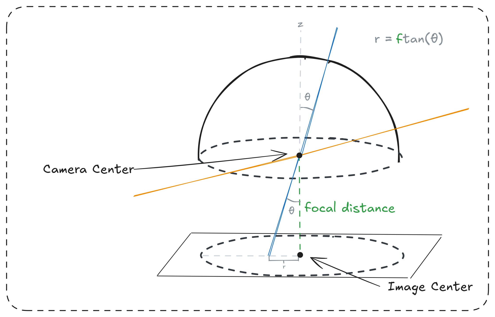                                                                                                                                                                                   | 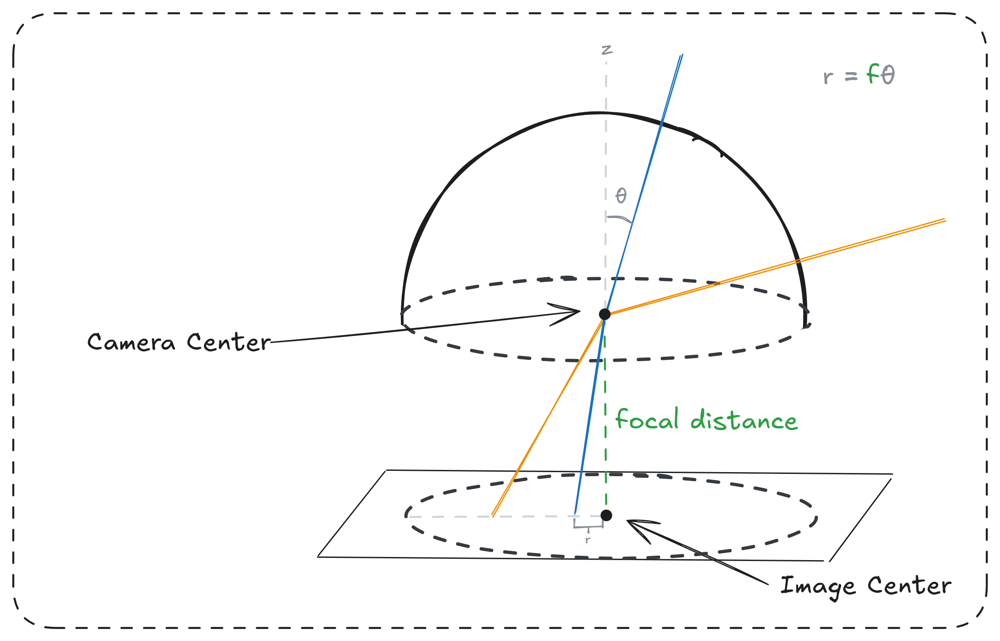                                                                                                            |
| Projection Type     | **Perspective Projection**: Maps a 3D point onto the image plane using a straight-line projection through a single pinhole (or a mathematical center of projection). Maintains linearity, meaning straight lines in 3D space remain straight in the 2D image. | **Non-linear projection**:  Maps a 3D point onto a hemispherical or circular image plane and introduces controlled distortion to achieve an ultra-wide FoV.                            |
| Field of View (FOV) | Limited by the geometry of the pinhole aperture and the image plane.  Typically ranges up to 90 degrees before distortion becomes significant.                                                                                                                | Extremely wide, up to 180 degrees or more. Captures more of the surrounding environment in a single image.                                                                             |
| Lens Distortion     | Assumes an idealized, distortion-free lens.  No barrel, pincushion, or other forms of lens distortion.                                                                                                                                                        | Includes significant intentional distortion to accommodate the ultra-wide FoV. Straight lines not passing through the image center appear curved.                                      |
| Applications        | Used in rendering engines and photography for creating realistic, undistorted images.  Ideal for applications requiring geometric accuracy, such as architectural visualization.                                                                              | Ideal for panoramic photography, VR imaging, robotics, and astrophotography. Used in applications where a large portion of the environment needs to be captured.                       |
| Advantages          | Simple mathematical formulation.  Preserves proportions and shapes in the image.                                                                                                                                                                              | Captures a much wider scene in a single image.  Useful for immersive experiences or where spatial awareness is crucial.                                                                |
| Limitations         | Narrower FoV compared to fisheye cameras.  Cannot capture very wide scenes in a single frame.                                                                                                                                                                 | Images are heavily distorted, making them less suitable for tasks requiring geometric accuracy. Straight lines in the real world are curved unless they pass through the optical axis. |

Overall, the most important difference to notice is that while in the pinhole model, the angle of incidence with respect to the optical axis is the same as the ray's angle when intersecting the image plane, in the fisheye model, the angle intersecting the image plane is distorted, allowing for wider FOVs to remain withinf frame.

### Gradient Derivation

The key to understanding the gradient derivation is keeping the following in mind: We are given the loss with respect to the projected gaussian in the tangent plane. We would like to "transport" that loss onto the gaussian's image space mean, such that we can eventually propagate it to the gaussian's 3D center.

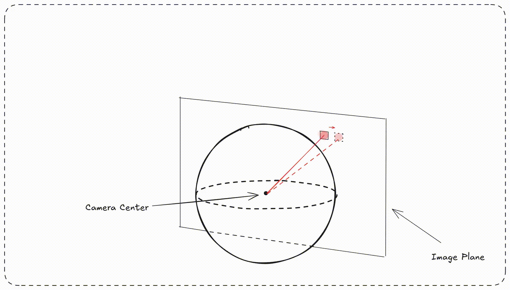

#### Forward

Suppose we have an image coordinate

$$ \vec{p} = \begin{bmatrix} p_x \\ p_y \end{bmatrix} $$

Then, given camera center $\vec{c} \in \mathbb{R}_{\ge 0}^2$ and focal length $\vec{f} \in \mathbb{R}_{\ge 0}^2$, We first calculate the radius of the image coordinate $r$ as follows: 

$$ r(\vec{p}) = \sqrt{\frac{\left(p_x - c_x\right)^{2}}{f_{x}^{2}} + \frac{\left(p_y - c_y\right)^{2}}{f_{y}^{2}}} $$

We can the project $\vec{p}$ into the camera space ray $\vec{r}$ using the following formula.

$$
\vec{r}(\vec{p}) = \left[\begin{matrix}
\frac{\left(p_x - c_x\right) \sin{r}}{rf_{x}} \\ 
\frac{\left(p_y - c_y\right) \sin{r}}{rf_{y}}\\
\cos{r}
\end{matrix} \right]
$$

Now, suppose we want to render a gaussian with image space mean

$$\vec{g} = \begin{bmatrix} u_g \\ v_g \end{bmatrix} $$

onto image pixel 

$$\vec{i} = \begin{bmatrix} u_i \\ v_i \end{bmatrix} $$

You can imagine that we have calculated a bounding box for our gaussian in the image plane with overlaps onto the specificied image pixel. Then, we can first calculate the **unit** ray associated with the image pixel $\vec{t}$

$$\vec{t} = \frac{\vec{r}(\vec{i})}{\|\vec{r}(\vec{i})\|_2} = \begin{bmatrix} t_x \\ t_y \\ t_z\end{bmatrix}$$

Additionally, we calculate the projection of the gaussian image space mean onto the unit-sphere, (the local origin for the tangent plane), calling it $\vec{\mu}$.

$$\vec{\mu} = \frac{\vec{r}(\vec{g})}{\|\vec{r}(\vec{g})\|_2} = \begin{bmatrix} \mu_x \\ \mu_y \\ \mu_z\end{bmatrix}$$

Recall that the formula for a plane is $\vec{n} \cdot (\vec{a} - \vec{a}_0) = 0$, where $\vec{n}$ is a vector orthogonal to the plan and $\vec{a}_0$ lies in the plane. If $\vec{n}$ is a unit vector and lies in the plane (as in $\vec{\mu}$), then we have

$$
\vec{n} \cdot (\vec{a} - \vec{n}) = 0 \\
\vec{n} \cdot \vec{a}  = \vec{n} \cdot \vec{n} \\
\vec{n} \cdot \vec{a}  = 1
$$

In our case, we would like to project the image pixel ray $\vec{t}$ onto the tangent plane $\mu_xx + \mu_yy + \mu_zz = 1$. To do so, we use the optimal projection function defined in the paper [1] to get the projection.

$$
\vec{x}_{\mathrm{2D}} = \left[\begin{matrix}\frac{t_{x}}{\mu_{x} t_{x} + \mu_{y} t_{y} + \mu_{z} t_{z}}\\\frac{t_{y}}{\mu_{x} t_{x} + \mu_{y} t_{y} + \mu_{z} t_{z}}\\\frac{t_{z}}{\mu_{x} t_{x} + \mu_{y} t_{y} + \mu_{z} t_{z}}\end{matrix}\right]
$$

However, we note that this is a single vector. Remember that the gaussian's covariance is projected onto a tangent plane with a **local coordinate frame**. To align our tangent-plane projected pixel ray with this local coordinate frame such that the components align with the gaussian's covariance axes, we multiply by the matrix $\mathbf{Q}$.

$$
\mathbf{Q} = \left[\begin{matrix}\frac{\mu_{z}}{\sqrt{\mu_{x}^{2} + \mu_{z}^{2}}} & 0 & - \frac{\mu_{x}}{\sqrt{\mu_{x}^{2} + \mu_{z}^{2}}}\\- \frac{\mu_{x} \mu_{y}}{\sqrt{\mu_{x}^{2} + \mu_{z}^{2}} \sqrt{\mu_{x}^{2} + \mu_{y}^{2} + \mu_{z}^{2}}} & \frac{\sqrt{\mu_{x}^{2} + \mu_{z}^{2}}}{\sqrt{\mu_{x}^{2} + \mu_{y}^{2} + \mu_{z}^{2}}} & - \frac{\mu_{y} \mu_{z}}{\sqrt{\mu_{x}^{2} + \mu_{z}^{2}} \sqrt{\mu_{x}^{2} + \mu_{y}^{2} + \mu_{z}^{2}}}\\\frac{\mu_{x}}{\sqrt{\mu_{x}^{2} + \mu_{y}^{2} + \mu_{z}^{2}}} & \frac{\mu_{y}}{\sqrt{\mu_{x}^{2} + \mu_{y}^{2} + \mu_{z}^{2}}} & \frac{\mu_{z}}{\sqrt{\mu_{x}^{2} + \mu_{y}^{2} + \mu_{z}^{2}}}\end{matrix}\right]
$$

to get the vector $\vec{d}$, which represents the distance from the pixel's projection to gaussian mean in the tangent plane. This is used to calculate the conic and the gaussian's contribution to said pixel.

$$
\vec{d} = \left[\begin{matrix}\frac{- \mu_{x} t_{z} + \mu_{z} t_{x}}{\sqrt{\mu_{x}^{2} + \mu_{z}^{2}} \left(\mu_{x} t_{x} + \mu_{y} t_{y} + \mu_{z} t_{z}\right)} \\ 
\frac{- \mu_{y} \left(\mu_{x} t_{x} + \mu_{z} t_{z}\right) + t_{y} \left(\mu_{x}^{2} + \mu_{z}^{2}\right)}{\sqrt{\mu_{x}^{2} + \mu_{z}^{2}} \sqrt{\mu_{x}^{2} + \mu_{y}^{2} + \mu_{z}^{2}} \left(\mu_{x} t_{x} + \mu_{y} t_{y} + \mu_{z} t_{z}\right)} \\
\frac{1}{\sqrt{\mu_{x}^{2} + \mu_{y}^{2} + \mu_{z}^{2}}}\end{matrix}\right]
= \left[\begin{matrix}\frac{- \mu_{x} t_{z} + \mu_{z} t_{x}}{\sqrt{\mu_{x}^{2} + \mu_{z}^{2}} \left(\mu_{x} t_{x} + \mu_{y} t_{y} + \mu_{z} t_{z}\right)}\\ 
\frac{- \mu_{y} \left(\mu_{x} t_{x} + \mu_{z} t_{z}\right) + t_{y} \left(\mu_{x}^{2} + \mu_{z}^{2}\right)}{\sqrt{\mu_{x}^{2} + \mu_{z}^{2}} \left(\mu_{x} t_{x} + \mu_{y} t_{y} + \mu_{z} t_{z}\right)} \\
1 \end{matrix}\right]
$$

#### Backward

When calulating the backward gradient, you can imagine we have fully rendered the image and have computed the loss $L$. Now, through the gradient of the gaussian's conic, opacity, and power, we can eventually get the jacobian.

$$ \mathbf{J}_L(\vec{d}) = \begin{bmatrix} \frac{\partial L}{\partial d_x} & \frac{\partial L}{\partial d_y} & 0\end{bmatrix} $$

We need to calculate the jacobian $\mathbf{J}_L(\vec{g})$, the gradient with respect to the gaussian's image space mean. To do so, we repeatedly apply the chain rule. First, we calculate $\mathbf{J}_{\vec{d}}(\vec{\mu})$ (we omit the full gradient due to its length, but we calculate it using a symbolic solver) Please refer to the [derivation](nb/derivation_simple.ipynb) for the full details.

$$
\mathbf{J}_{\vec{d}}(\vec{\mu}) = \begin{bmatrix}
\frac{\partial d_x}{\partial \mu_x} & \frac{\partial d_x}{\partial \mu_y} & \frac{\partial d_x}{\partial \mu_y} \\
\frac{\partial d_y}{\partial \mu_x} & \frac{\partial d_y}{\partial \mu_y} & \frac{\partial d_y}{\partial \mu_y} \\
0 & 0 & 0
\end{bmatrix}
$$

For ease of notation, let

$$\vec{r}(\vec{g}) = \begin{bmatrix} r_x \\ r_y \\ r_z \end{bmatrix}$$

We can then calculate the jccobian $\mathbf{J}_{\vec{d}}(\vec{r}(\vec{g}))$

$$
\mathbf{J}_{\vec{d}}(\vec{r}(\vec{g})) = \left[\begin{matrix}
\frac{r_{y}^{2} + r_{z}^{2}}{\left(r_{x}^{2} + r_{y}^{2} + r_{z}^{2}\right)^{\frac{3}{2}}} & - \frac{r_{x} r_{y}}{\left(r_{x}^{2} + r_{y}^{2} + r_{z}^{2}\right)^{\frac{3}{2}}} & - \frac{r_{x} r_{z}}{\left(r_{x}^{2} + r_{y}^{2} + r_{z}^{2}\right)^{\frac{3}{2}}}\\- \frac{r_{x} r_{y}}{\left(r_{x}^{2} + r_{y}^{2} + r_{z}^{2}\right)^{\frac{3}{2}}} & \frac{r_{x}^{2} + r_{z}^{2}}{\left(r_{x}^{2} + r_{y}^{2} + r_{z}^{2}\right)^{\frac{3}{2}}} & - \frac{r_{y} r_{z}}{\left(r_{x}^{2} + r_{y}^{2} + r_{z}^{2}\right)^{\frac{3}{2}}}\\- \frac{r_{x} r_{z}}{\left(r_{x}^{2} + r_{y}^{2} + r_{z}^{2}\right)^{\frac{3}{2}}} & - \frac{r_{y} r_{z}}{\left(r_{x}^{2} + r_{y}^{2} + r_{z}^{2}\right)^{\frac{3}{2}}} & \frac{r_{x}^{2} + r_{y}^{2}}{\left(r_{x}^{2} + r_{y}^{2} + r_{z}^{2}\right)^{\frac{3}{2}}}\end{matrix}\right]
$$

We then finally calculate the jacobian $\mathbf{J}_{\vec{r}}(\vec{g})$. We again omit the full expression because of its length, but we urge the reader to refer to the full [derivation](nb/derivation_simple.ipynb) for details:

$$
\mathbf{J}_{\vec{r}}(\vec{g}) = \begin{bmatrix}
\frac{\partial r_x}{\partial u_g} & \frac{\partial r_x}{\partial v_g} \\
\frac{\partial r_y}{\partial u_g} & \frac{\partial r_y}{\partial v_g} \\
\frac{\partial r_z}{\partial u_g} & \frac{\partial r_z}{\partial v_g} \\
\end{bmatrix}
$$

Therefore the full jacobian $\mathbf{J}_L(\vec{g})$ can be calcuated as follows:

$$
\mathbf{J}_L(\vec{g}) = \mathbf{J}_L(\vec{d}) \mathbf{J}_{\vec{d}}(\vec{\mu}) \mathbf{J}_{\vec{d}}(\vec{r}(\vec{g})) \mathbf{J}_{\vec{r}}(\vec{g})
$$

We note that our use of the jacobian notation here hides much of the very expensive math that goes into solving this equation. We make use of [cse](https://docs.sympy.org/latest/modules/rewriting.html) to simplify some calculations.


### Current State

As of 12/01/24, the fisheye camera model implementation still has bugs to fix. We provide a comparison of what our rendering currently generates versus a proper fisheye projection:

| Ideal Fisheye                                      | Ours                                                             |
| -------------------------------------------------- | ---------------------------------------------------------------- |
| 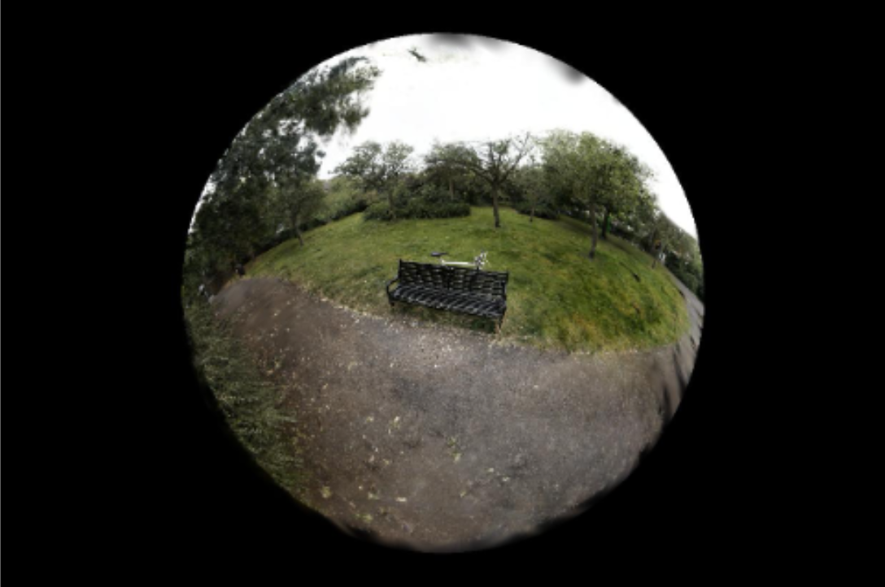 | 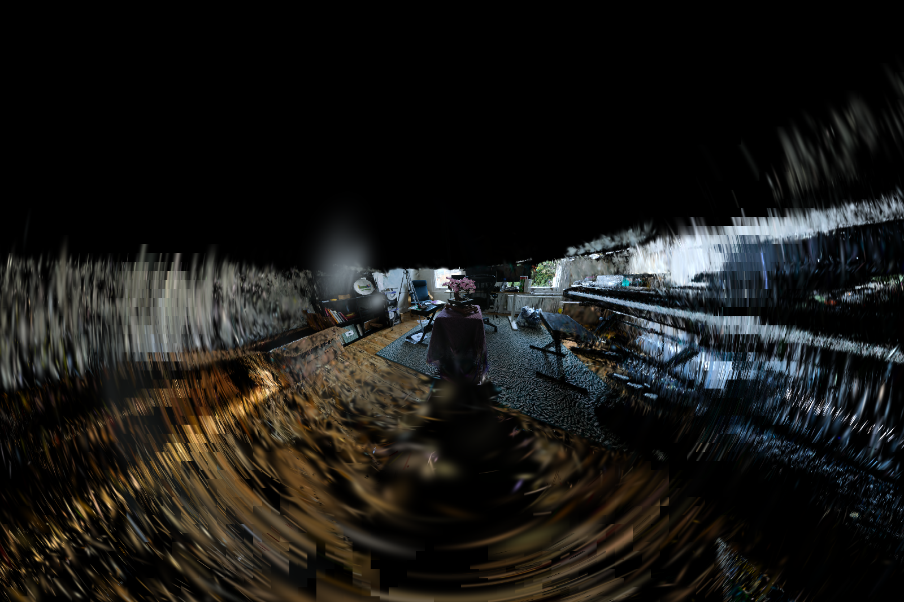 |

We do see the characteristic circular pattern we would expect to see out of a fisheye lens; however, there are many artifacts outside the circle that represents the max fov. I theorize that this has to do with how the gaussian bounding boxes are being calculated. More work must be done.


## Gaussian Splatting SLAM


## Gaussian Splatting SLAM Installation

To install our custom compatible Gaussian Splatting SLAM installation, clone the repository using
```shell
git submodule init
git submodule update
```

Verify that in `submodules/MonoGS`, you have checked out the `optisplat.speedup` branch. Then, install the necessary requirements:

```shell
pip install -r requirements.txt
```

Note: Please see [lycon](https://github.com/ethereon/lycon) and [lietorch](https://github.com/princeton-vl/lietorch) to ensure that the proper dependencies are installed so that the speedup may be enabled.

Finally, to enable support for pose optimization, run the command below:

```shell
# Pinhole with pose optimization
pip install submodules/diff-gaussian-rasterization-pinhole-opt-w-pose
```


## Acknowledgements

This project is built upon [op43dgs](https://github.com/LetianHuang/op43dgs). Please follow the license of op43dgs. We thank all the authors for their great work. Additonally, we build heavily upon [MonoGS](https://github.com/muskie82/MonoGS). 

## Documentation

* [Project Pitch](https://docs.google.com/presentation/d/12cumM1NYkJ7Nz2546gtauragFJXBte2i5zr2OOwhN4w/edit?usp=sharing)  
* [Milestone 1](https://docs.google.com/presentation/d/1kTaBZR_AYzOxLMjsLN8go0clONUSYL47gi0aoIQo9Wg/edit?usp=sharing)  
* [Milestone 2](https://docs.google.com/presentation/d/1asgsxSQ5VbEdhZiO-TxcCMCsjYq1s7_qwXEn_w4wN_g/edit?usp=drive_link)
* [Milestone 3](https://docs.google.com/presentation/d/1g-BpCL5niX12zsmYnQpC8C8AzdGHj43fHt41Tv6y5xk/edit?usp=drive_link)

## References

- [1] On the Error Analysis of 3D Gaussian Splatting and an Optimal Projection Strategy: https://arxiv.org/pdf/2402.00752

- [2] Taming 3DGS: High-Quality Radiance Fields with Limited Resources: https://arxiv.org/pdf/2406.15643