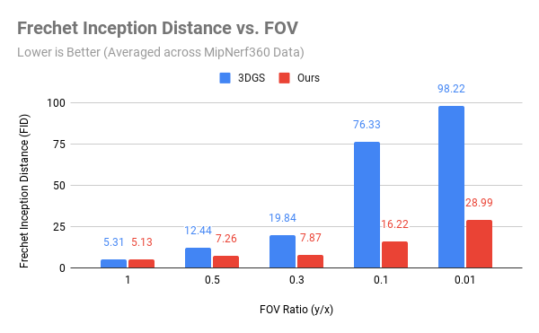
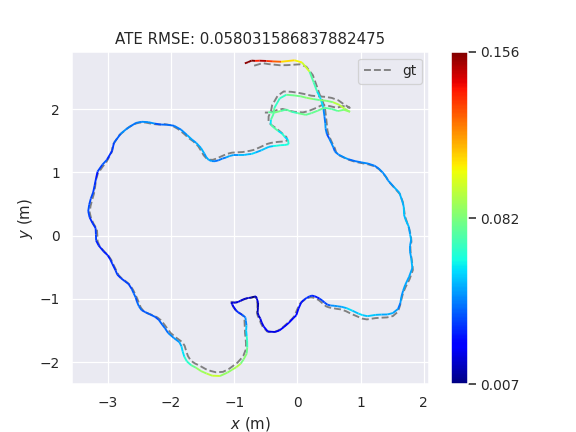

Optisplat
================

**University of Pennsylvania, CIS 565: GPU Programming and Architecture, Final Project**

* Rahul Aggarwal, Josh Smith, Mike Rabbitz
  * Linkedins: [Rahul Aggarwal](https://www.linkedin.com/in/rahul-aggarwal-32133a1b3/), [Josh Smith](https://www.linkedin.com/in/joshua-smith-32b165158/), [Mike Rabbitz](https://www.linkedin.com/in/mike-rabbitz/)
* Tested on: Ubuntu 20.04 x86_64, AMD EPYC 7452 32-Core (128) @ 2.35GHz 512GB, NVIDIA RTX A6000 48GB


## Overview (What is optimal splatting?)

This project addresses the inherent limitations of traditional gaussian splatting techniques in rendering 3D scenes. Standard gaussian splatting involves approximating the projection of 3D gaussians into 2D splats using a first order approximation as the perspective transformation for 3D gaussians does not have a closed form. These projection errors degrade the quality of both training and inference in Gaussian splatting-based rendering.

A recent work [1] has proposed an alternative approach to improve the fidelity of Gaussian projections under perspective transformations. Instead of projecting Gaussians onto a flat plane, they propose radially projecting each 3D gaussian based on its mean along a line that connects it directly to the camera center. The projection lands each Gaussian on a plane tangent to the unit sphere and perpendicular to the projection line.


## Objectives (What are we aiming to achieve?)

We aim to make the following key contributions:

- [x] **Optimize Optimal Gaussian Splatting**. Currently, the baseline performance of optimal gaussian splatting when compared to the original implementation is a 3x *slowdown.* We aim to improve performance on optimal gaussian splatting by 66% by writing custom CUDA parallel code for both the forward and backward passes.

- [x] **Write the novel fisheye camera** forward and backward passes, making it possible to train and render gaussian splats directly from fisheye lenses. This will involve deriving the gradient between the local tangent plane and the image plane projections.

- [x] **Provide the first 360 degree camera gaussian splatting SLAM implementation**. Gaussian splatting SLAM has been done before with narrow FOV, pinhole cameras. However, 360 degree cameras offer a major challenge as they have a much wider FOV, which causes traditional gaussian splatting SLAM implementations to fail. Additionally, we have to deal with a different camera model, which we aim to first solve through rectification, and then through our fisheye implementation.


## Optisplat Installation

Clone the repository and create an anaconda environment using

```shell
git clone https://github.com/rahulaggarwal965/cis5650-final-project.git
cd cis5650-final-project
git submodule init
git submodule update

SET DISTUTILS_USE_SDK=1 # Windows only
conda env create --file environment.yml
conda activate optisplat
```

This repository contains support for various camera models: To install them, pick the specified camera model and run the command below. **We recommend starting with the pinhole implementation**.

```shell
# Pinhole
pip install submodules/diff-gaussian-rasterization-pinhole-opt
```

```shell
# Panorama
pip install submodules/diff-gaussian-rasterization-panorama
```

```shell
# Fisheye
pip install submodules/diff-gaussian-rasterization-fisheye-opt
```

## Optimal Splatting Datasets

### Mip-NeRF 360 Dataset

Please download the data from the [Mip-NeRF 360](https://jonbarron.info/mipnerf360/).

### Tanks & Temples dataset

Please download the data from the [3D Gaussian Splatting](https://repo-sam.inria.fr/fungraph/3d-gaussian-splatting/).

### Deep Blending

Please download the data from the [3D Gaussian Splatting](https://repo-sam.inria.fr/fungraph/3d-gaussian-splatting/).

## Training and Evaluation

By default, the trained models use all available images in the dataset. To train them while withholding a test set for evaluation, use the ```--eval``` flag. This way, you can render training/test sets and produce error metrics as follows:

```shell
python train.py -s <path to COLMAP or NeRF Synthetic dataset> --eval # Train with train/test split
python render.py -m <path to trained model> --fov_ratio 1 # Generate renderings
```

<details>
<summary><span style="font-weight: bold;">Command Line Arguments for render.py</span></summary>

  #### --model_path / -m 
  Path to the trained model directory you want to create renderings for.
  #### --skip_train
  Flag to skip rendering the training set.
  #### --skip_test
  Flag to skip rendering the test set.
  #### --quiet 
  Flag to omit any text written to standard out pipe. 
  #### --fov_ratio
  Focal length reduction ratios.

</details>

## OptiSplat Optimizations

One of our main goals of this project was to make optimal splatting fast enough for it to be feasible to use in a real-time SLAM system. To that end, here are a few optimizations we made. We give a full performance comparison in the summary section below. Additionally, note that forward-pass optimizations affect the backward-pass, but not vice-versa.

### Forward

#### Separated Spherical Harmonics

In the original 3DGS implementation, both the base color (0th SH band) and higher SH bands were merged into a single tensor prior to rasterization, leading to noticeable performance hits during the forward pass. To address this, we've restructured the differential rasterizer to load the Gaussian SH coefficients from separate tensors, streamlining the process and boosting performance.

Since the base color has a significantly higher weight in the color computation, combining it with the other SH bands introduces unnecessary computational overhead.

Use `--separate_sh` to enable this optimization when training.

#### Tangent Plane Preloading

When computing the tangent plane of each gaussian on the unit sphere, we have to do an expensive calculation involving projecting the ray, caculating the spherical coordinates for the ray and assigning a local coordinate frame to the resulting tangent plane. We note that the parallelization scheme for gaussian splatting assigns each *tile* a CUDA block and each *pixel* within a tile a thread. However, this means that each pixel must iterate through each Gaussian, computing the expensive ray intersection each time. Therefore, we implement a caching mechanism that stores the $sin$ and $cos$ of the spherical coordinates (unit length) in shared memory, loaded a warp at a time. This both reduces memory bandwith and computational overhead, which greatly improves performance.

This optimization is enabled by default during training.


### Backward

#### Sparse Gradient Propagation

During training, we know that each camera can only see a part of the scene. Therefore, we would not like to optimize the paremeters of all the gaussians in the scene. To do so, we may use a [Sparse ADAM](https://pytorch.org/docs/stable/generated/torch.optim.SparseAdam.html) optimizer. and a mask based on whether a Gaussian radius is on-screen or not. However, because of the nature of optimal splatting, gaussians not in view can still have a contribution to the resulting image due to their *tangent-plane contribution*. Therefore, we take this into account when calculating sparsity.

Use `--optimizer_type sparse_adam` to enable this optimization during training.


#### Fused SSIM

The Fused SSIM optimization was taken from [2], and involves optimizing the structural similarity index metric, which is used during loss computation. Below, we provide an excerpt from the paper.

>  3DGS loss computation involves evaluating the SSIM metric. It is configured to use 11×11 Gaussian kernel convolu-tion: we propose using optimized CUDA kernels to perform differentiable 2D convolution via two consecutive 1Dconvolutions since Gaussian kernels are separable in nature. In addition, we use a fused kernel for the evaluation of theSSIM metric from the convolved results. This speeds up the loss calculation and is particularly impactful when thenumber of optimized Gaussians is low compared to image resolution, which is the case when training on a budget.

Use `--fused_ssim` to enable this optimization during training.

#### Block-level Gradient Accumulation
In the diagrams in this section:
- a box represents a thread
- n represents block size
- i represents the iteration

We note that the parallelization scheme for gaussian splatting assigns each *tile* a CUDA block and each *pixel* within a tile a thread. However, this means that each pixel must iterate through each Gaussian.

Pre-Optimization:
- During each iteration, each thread computes partial gradients and writes to global gradient arrays using atomicAdd


Post-Optimization:
- During each iteration
  - Perform warp-level reduction of thread-computed partial gradients using __shfl_down_sync
  - Warp leader writes reduced value to shared memory
    - 2D shared memory: [iteration][warp_id]
   


- Once we fill up shared memory with enough iterations (batches), each warp takes a shared memory batch with NUM_WARPS partial gradients to reduce
- Perform warp-level reduction on the batch
- Warp leader writes final reduced gradient for the batch to global gradient arrays using atomicAdd


In theory, best case is that atomicAdd calls are reduced by 1/(32 * NUM_WARPS), where NUM_WARPS equals BLOCK_SIZE/32. In other words, this equals 1/BLOCK_SIZE.
- 1/32 from initial warp-level reduction
- 1/NUM_WARPS from second warp-level reduction

Drawback
- Increased block synchronization overhead

Switch to the `mike/optimization` branch to enable this optimization. Note that because of significant code changes, we choose to add this optimization as a separate branch for the purpose of doing an ablation study.

### Performance Summary


Our performance metrics were tested on a number of scenes, and overall we see a **44%** to **49%** average improvement due to our various optimizations. Below, we provide an analysis of the Bonsai scene to give a specific example of our optimization's performance on a medium size scene. **Note that the following scene is randomly picked**. We display example renderings and performance summary  below.


| fov_ratio | GT                           | Render                                                            |
| --------- | ---------------------------- | ----------------------------------------------------------------- |
| 1         |  |    |
| 0.1       |  |  |

Above, we see that our implementation performs quite well even as we increase the FOV, which thereby increases the number of Gaussians that need to be rendered.


Overall, we see a **44%** to **49%** improvement on the optimization phase of gaussian splatting, especially as we optimize further. We note that the longer the optimization process goes, the number of gaussians increase. However, we see that we also increase in our performance gain, implying that our optimizations perform better for more expensive operations.

We see that the most important optimization is the separating of the spherical harmonic components, which makes sense because it applies to both the forward and backward passes. In addition, block-level gradient accumulation is very effective in reducing global memory accesses. The Sparse ADAM, Fused SSIM, and tangent preloading all provide smaller (~5%) improvements that add to solid performance.

### Performance vs. Scene Complexity

We would like to verify our claim on how we achieve better performance on more complex scenes. To aid this discussion, we use the number of final gaussians during optimization as a proxy for scene complexity, with the idea that more complex scenes with higher amounts of detail need more gaussians to accurately be captured.


#### Key Observations:

* **General Trend:**
As the number of Gaussians increases (indicating higher scene complexity), optimization time grows for both methods (Baseline and Optimized). However:  
  * The **Baseline** (blue line) exhibits a much steeper increase in optimization time.
  * The **Optimized** method (red line) grows significantly slower, showcasing its efficiency.
* **Lower Time with Higher Complexity:**
At smaller Gaussian counts, such as:
  * **Bicycle (1M Gaussians)**: Baseline takes ~101 minutes, while Optimized is much faster at approximately 50-60 minutes.
  * **Bonsai and Kitchen (1.5M-2M Gaussians)**: The time gap widens. Baseline is at ~122 and ~133.6 minutes, respectively, while the Optimized method increases minimally.
  * **Truck and Flowers (>2.5M Gaussians)**: The Baseline grows to ~180-240 minutes, while the Optimized remains much lower, increasing only linearly and reaching a maximum of around 140 minutes.
* **Efficiency Scaling:** The Optimized method’s improvement over the Baseline becomes **more significant as the scene complexity increases:**
  * At lower Gaussian counts, the time savings are notable but moderate.
  * At higher Gaussian counts (e.g., ~3.5M Gaussians), the gap is very large, indicating that the optimization scales effectively compared to the baseline.

#### Conclusion
The optimized method performs substantially better in terms of scalability as the number of Gaussians (scene complexity) increases. While both methods experience longer optimization times with larger scenes, the optimized approach reduces the rate of growth, making it far more suitable for complex scenarios. This is critical for applications where efficiency at scale matters.

### Image Quality vs. FoV

In order to benchmark quality across different field of views and to make sure that our optimizations do not degrade quality, we make use of the [Frechet Incpetion Distance](https://en.wikipedia.org/wiki/Fr%C3%A9chet_inception_distance). With FID, each image is compared to the entire distribution of images to get a distance where a lower FID is a better result. We must use this because we do not have ground truth for high FOV images. We compare our results with the *original 3DGS* paper to get a sense of how our image quality gets better at higher field of views, something that the original paper does not support. Our x-axis here is the **FOV ratio** or the ratio of the vertical FOV divided by the horizontal FOV. In this sense, our FOV gets larger as our FOV ratio gets smaller.



Our proposed method outperforms the original method across all FOV ratios, and has the most significant quality gains when the FOV is extremely high.

## Fisheye Camera Model Implementation

We recommend using the `josh_fisheye` branch to render. (Note: we keep this as a separate branch because of non-compatible changes with rasterization settings, namely, an additional parameter.)


Below, we detail our intuition and implementation for our fisheye camera model implementation.

### Camera Models

The pinhole camera model and the fisheye camera model are two distinct approaches to simulating camera behavior in computer graphics, photography, and optical systems. They differ in how they project the 3D world onto a 2D image plane. Here’s a detailed comparison:

| Aspect              | Pinhole                                                                                                                                                                                                                                                       | Fisheye  (Equidistant Projection Model)                                                                                                                                                |
| ------------------- | ------------------------------------------------------------------------------------------------------------------------------------------------------------------------------------------------------------------------------------------------------------- | -------------------------------------------------------------------------------------------------------------------------------------------------------------------------------------- |
| Diagram             |                                                                                                                                                                                    |                                                                                                             |
| Projection Type     | **Perspective Projection**: Maps a 3D point onto the image plane using a straight-line projection through a single pinhole (or a mathematical center of projection). Maintains linearity, meaning straight lines in 3D space remain straight in the 2D image. | **Non-linear projection**:  Maps a 3D point onto a hemispherical or circular image plane and introduces controlled distortion to achieve an ultra-wide FoV.                            |
| Field of View (FOV) | Limited by the geometry of the pinhole aperture and the image plane.  Typically ranges up to 90 degrees before distortion becomes significant.                                                                                                                | Extremely wide, up to 180 degrees or more. Captures more of the surrounding environment in a single image.                                                                             |
| Lens Distortion     | Assumes an idealized, distortion-free lens.  No barrel, pincushion, or other forms of lens distortion.                                                                                                                                                        | Includes significant intentional distortion to accommodate the ultra-wide FoV. Straight lines not passing through the image center appear curved.                                      |
| Applications        | Used in rendering engines and photography for creating realistic, undistorted images.  Ideal for applications requiring geometric accuracy, such as architectural visualization.                                                                              | Ideal for panoramic photography, VR imaging, robotics, and astrophotography. Used in applications where a large portion of the environment needs to be captured.                       |
| Advantages          | Simple mathematical formulation.  Preserves proportions and shapes in the image.                                                                                                                                                                              | Captures a much wider scene in a single image.  Useful for immersive experiences or where spatial awareness is crucial.                                                                |
| Limitations         | Narrower FoV compared to fisheye cameras.  Cannot capture very wide scenes in a single frame.                                                                                                                                                                 | Images are heavily distorted, making them less suitable for tasks requiring geometric accuracy. Straight lines in the real world are curved unless they pass through the optical axis. |

Overall, the most important difference to notice is that while in the pinhole model, the angle of incidence with respect to the optical axis is the same as the ray's angle when intersecting the image plane, in the fisheye model, the angle intersecting the image plane is distorted, allowing for wider FOVs to remain withinf frame.

### Gradient Derivation

The key to understanding the gradient derivation is keeping the following in mind: We are given the loss with respect to the projected gaussian in the tangent plane. We would like to "transport" that loss onto the gaussian's image space mean, such that we can eventually propagate it to the gaussian's 3D center.


#### Forward

Suppose we have an image coordinate

$$
\vec{p} = \begin{bmatrix}
p_x \\ 
p_y
\end{bmatrix}
$$

Then, given camera center $\vec{c} \in \mathbb{R}^2_{\ge 0}$ and focal length $\vec{f} \in \mathbb{R}^2_{\ge 0}$, We first calculate the radius of the image coordinate $r$ as follows: 

$$ r(\vec{p}) = \sqrt{\frac{\left(p_x - c_x\right)^{2}}{f_{x}^{2}} + \frac{\left(p_y - c_y\right)^{2}}{f_{y}^{2}}} $$

We can the project $\vec{p}$ into the camera space ray $\vec{r}$ using the following formula.

```math
\vec{r}(\vec{p}) = \left[\begin{matrix}
\frac{\left(p_x - c_x\right) \sin(r)}{rf_{x}} \\ 
\frac{\left(p_y - c_y\right) \sin(r)}{rf_{y}}\\
\cos(r)
\end{matrix} \right]
```

Now, suppose we want to render a gaussian with image space mean

```math
\vec{g} = \begin{bmatrix}
u_g \\
v_g
\end{bmatrix}
```

onto image pixel 

```math
\vec{i} = \begin{bmatrix}
u_i \\
v_i
\end{bmatrix}
```

You can imagine that we have calculated a bounding box for our gaussian in the image plane with overlaps onto the specificied image pixel. Then, we can first calculate the **unit** ray associated with the image pixel $\vec{t}$

```math
\vec{t} = \frac{\vec{r}(\vec{i})}{\|\vec{r}(\vec{i})\|_2} =
\begin{bmatrix}
t_x \\
t_y \\
t_z
\end{bmatrix}
```

Additionally, we calculate the projection of the gaussian image space mean onto the unit-sphere, (the local origin for the tangent plane), calling it $\vec{\mu}$.

```math
\vec{\mu} = \frac{\vec{r}(\vec{g})}{\|\vec{r}(\vec{g})\|_2} =
\begin{bmatrix}
\mu_x \\
\mu_y \\
\mu_z
\end{bmatrix}
```

Recall that the formula for a plane is $\vec{n} \cdot (\vec{a} - \vec{a}_0) = 0$, where $\vec{n}$ is a vector orthogonal to the plan and $\vec{a}_0$ lies in the plane. If $\vec{n}$ is a unit vector and lies in the plane (as in $\vec{\mu}$), then we have

```math
\begin{align*}
\vec{n} \cdot (\vec{a} - \vec{n}) &= 0 \\
\vec{n} \cdot \vec{a}  &= \vec{n} \cdot \vec{n} \\
\vec{n} \cdot \vec{a}  &= 1
\end{align*}
```

In our case, we would like to project the image pixel ray $\vec{t}$ onto the tangent plane $\mu_xx + \mu_yy + \mu_zz = 1$. To do so, we use the optimal projection function defined in the paper [1] to get the projection.

```math
\vec{x}_{\mathrm{2D}} =
\left[\begin{matrix}
\frac{t_{x}}{\mu_{x} t_{x} + \mu_{y} t_{y} + \mu_{z} t_{z}}\\
\frac{t_{y}}{\mu_{x} t_{x} + \mu_{y} t_{y} + \mu_{z} t_{z}}\\
\frac{t_{z}}{\mu_{x} t_{x} + \mu_{y} t_{y} + \mu_{z} t_{z}}
\end{matrix}\right]
```

However, we note that this is a single vector. Remember that the gaussian's covariance is projected onto a tangent plane with a **local coordinate frame**. To align our tangent-plane projected pixel ray with this local coordinate frame such that the components align with the gaussian's covariance axes, we multiply by the matrix $\mathbf{Q}$.

```math
\mathbf{Q} =
\left[\begin{matrix}\frac{\mu_{z}}{\sqrt{\mu_{x}^{2} + \mu_{z}^{2}}} & 0 & - \frac{\mu_{x}}{\sqrt{\mu_{x}^{2} + \mu_{z}^{2}}}\\- \frac{\mu_{x} \mu_{y}}{\sqrt{\mu_{x}^{2} + \mu_{z}^{2}} \sqrt{\mu_{x}^{2} + \mu_{y}^{2} + \mu_{z}^{2}}} & \frac{\sqrt{\mu_{x}^{2} + \mu_{z}^{2}}}{\sqrt{\mu_{x}^{2} + \mu_{y}^{2} + \mu_{z}^{2}}} & - \frac{\mu_{y} \mu_{z}}{\sqrt{\mu_{x}^{2} + \mu_{z}^{2}} \sqrt{\mu_{x}^{2} + \mu_{y}^{2} + \mu_{z}^{2}}}\\\frac{\mu_{x}}{\sqrt{\mu_{x}^{2} + \mu_{y}^{2} + \mu_{z}^{2}}} & \frac{\mu_{y}}{\sqrt{\mu_{x}^{2} + \mu_{y}^{2} + \mu_{z}^{2}}} & \frac{\mu_{z}}{\sqrt{\mu_{x}^{2} + \mu_{y}^{2} + \mu_{z}^{2}}}
\end{matrix}\right]
```

to get the vector $\vec{d}$, which represents the distance from the pixel's projection to gaussian mean in the tangent plane. This is used to calculate the conic and the gaussian's contribution to said pixel.

```math
\vec{d} =
\begin{bmatrix}
\frac{- \mu_x t_z + \mu_z t_x}{\sqrt{\mu_x^2 + \mu_z^2} (\mu_x t_x + \mu_y t_y + \mu_z t_z)} \\ 
\frac{- \mu_y (\mu_x t_x + \mu_z t_z) + t_y (\mu_x^2 + \mu_z^2)}{\sqrt{\mu_x^2 + \mu_z^2} \sqrt{\mu_x^2 + \mu_y^2 + \mu_z^2} (\mu_x t_x + \mu_y t_y + \mu_z t_z)} \\
\frac{1}{\sqrt{\mu_x^2 + \mu_y^2 + \mu_z^2}}
\end{bmatrix} =
\begin{bmatrix}
\frac{- \mu_x t_z + \mu_z t_x}{\sqrt{\mu_x^2 + \mu_z^2} (\mu_x t_x + \mu_y t_y + \mu_z t_z)} \\
\frac{- \mu_y (\mu_x t_x + \mu_z t_z) + t_y (\mu_x^2 + \mu_z^2)}{\sqrt{\mu_x^2 + \mu_z^2} (\mu_x t_x + \mu_y t_y + \mu_z t_z)} \\
1
\end{bmatrix}
```

#### Backward

When calulating the backward gradient, you can imagine we have fully rendered the image and have computed the loss $L$. Now, through the gradient of the gaussian's conic, opacity, and power, we can eventually get the jacobian.

```math
\mathbf{J}_L(\vec{d}) = \begin{bmatrix} \frac{\partial L}{\partial d_x} & \frac{\partial L}{\partial d_y} & 0\end{bmatrix}
```

We need to calculate the jacobian $\mathbf{J}\_L(\vec{d})$, the gradient with respect to the gaussian's image space mean. To do so, we repeatedly apply the chain rule. First, we calculate $\mathbf{J}_{\vec{d}}(\vec{\mu})$ (we omit the full gradient due to its length, but we calculate it using a symbolic solver) Please refer to the [derivation](nb/derivation_simple.ipynb) for the full details.

```math
\mathbf{J}_{\vec{d}}(\vec{\mu}) =
\begin{bmatrix}
\frac{\partial d_x}{\partial \mu_x} & \frac{\partial d_x}{\partial \mu_y} & \frac{\partial d_x}{\partial \mu_y} \\
\frac{\partial d_y}{\partial \mu_x} & \frac{\partial d_y}{\partial \mu_y} & \frac{\partial d_y}{\partial \mu_y} \\
0 & 0 & 0
\end{bmatrix}
```

For ease of notation, let

```math
\vec{r}(\vec{g}) =
\begin{bmatrix}
r_x \\
r_y \\
r_z
\end{bmatrix}
```

We can then calculate the jccobian $\mathbf{J}_{\vec{d}}(\vec{r}(\vec{g}))$

```math
\mathbf{J}_{\vec{d}}(\vec{r}(\vec{g})) =
\begin{bmatrix}
\frac{r_y^{2} + r_z^{2}}{(r_x^{2} + r_y^{2} + r_z^{2})^{\frac{3}{2}}} & - \frac{r_x r_y}{(r_x^{2} + r_y^{2} + r_z^{2})^{\frac{3}{2}}} & - \frac{r_x r_z}{(r_x^{2} + r_y^{2} + r_z^{2})^{\frac{3}{2}}} \\
-\frac{r_x r_y}{(r_x^{2} + r_y^{2} + r_z^{2})^{\frac{3}{2}}} & \frac{r_x^{2} + r_z^{2}}{(r_x^{2} + r_y^{2} + r_z^{2})^{\frac{3}{2}}} & - \frac{r_y r_z}{(r_x^{2} + r_y^{2} + r_z^{2})^{\frac{3}{2}}} \\
-\frac{r_x r_z}{(r_x^{2} + r_y^{2} + r_z^{2})^{\frac{3}{2}}} & - \frac{r_y r_z}{(r_x^{2} + r_y^{2} + r_z^{2})^{\frac{3}{2}}} & \frac{r_x^{2} + r_y^{2}}{(r_x^{2} + r_y^{2} + r_z^{2})^{\frac{3}{2}}}
\end{bmatrix}
```

We then finally calculate the jacobian $\mathbf{J}_{\vec{r}}(\vec{g})$. We again omit the full expression because of its length, but we urge the reader to refer to the full [derivation](nb/derivation_simple.ipynb) for details:

```math
\mathbf{J}_{\vec{r}}(\vec{g}) = \begin{bmatrix}
\frac{\partial r_x}{\partial u_g} & \frac{\partial r_x}{\partial v_g} \\
\frac{\partial r_y}{\partial u_g} & \frac{\partial r_y}{\partial v_g} \\
\frac{\partial r_z}{\partial u_g} & \frac{\partial r_z}{\partial v_g} \\
\end{bmatrix}
```

Therefore the full jacobian $\mathbf{J}_L(\vec{g})$ can be calcuated as follows:

```math
\mathbf{J}_L(\vec{g}) = \mathbf{J}_L(\vec{d}) \mathbf{J}_{\vec{d}}(\vec{\mu}) \mathbf{J}_{\vec{d}}(\vec{r}(\vec{g})) \mathbf{J}_{\vec{r}}(\vec{g})
```

We note that our use of the jacobian notation here hides much of the very expensive math that goes into solving this equation. We make use of [cse](https://docs.sympy.org/latest/modules/rewriting.html) to simplify some calculations.


### Example Renders (without FoV limiting)

In order to generate clean renders, we provide a limiting FOV factor that generates the black background in the above images. Without this, we generate images like those shown below.

| Example 1                                      | Example 2                                                             |
| -------------------------------------------------- | ---------------------------------------------------------------- |
|  |  |

We see that the centers of the image are quite visually accurate and have the distortion we would expect to see of a fisheye lens. However, there are many artifacts at the edge of the lens, which seem to be examples of gaussians behind the image plane being projected onto the image. Further work must be done to resolve these issues--like with more accurate bounding boxes, etc.

## Gaussian Splatting SLAM

Gaussian splatting SLAM is a method that combines simultaneous localization and mapping (SLAM) with gaussian splatting, a technique used for rendering and reconstructing 3D scenes.


### SLAM Framework
* SLAM continuously estimates a moving device's position and orientation (localization) while simultaneously building a map of the environment.
* It processes input data, typically from cameras, LiDAR, or depth sensors, to compute pose estimates and map updates.

### Gaussian Splatting
* This is a point-based rendering approach where the 3D scene is represented by a collection of Gaussian blobs, which define the spatial extent and appearance of scene elements.
* Each Gaussian is parameterized by its position, size, orientation, and color (or other attributes).

### Combining Both
* As the SLAM algorithm reconstructs the environment, Gaussian splats are dynamically placed or updated to represent the scene geometry and appearance in a compact and visually realistic way.
* Gaussian splats offer smooth, continuous scene representation and can effectively model fine details and soft transitions.

### Applications
* This combination is especially useful in real-time mapping and visualization tasks, where efficient rendering and reconstruction of complex scenes are necessary.
* The method is lightweight compared to traditional dense SLAM and enables fast updates.

Overall, Gaussian splatting SLAM leverages the compactness and efficiency of Gaussian splatting to enhance SLAM's ability to reconstruct and render environments in real-time.

## Optimal Splatting SLAM


We decided to approach the idea of integrating our optimal splatting approach with gaussian splatting SLAM because many robots in the current world use fisheye or other wide-fov lenses. This allows them to see more of their surroundings, thereby allowing them to reason better about their current location and next actions. Indeed, we expect gaussian splatting to be a great tool for SLAM in the future because it is able to efficiently and robustly model the scene's photometric detail. However, as of now, there is no gaussian splatting SLAM model that allows you to use wide FOV cameras. Therefore, we take on the task of adding camera and depth gradients to our optimal splatting approach to make our algorithm amenable to a SLAM setting.

Below, we detail how the camera gradient gets calculated:


Intuitively, we can understand the process as **continuing** the gradient propagation past the 3D gaussian mean and covariance onto the camera pose. We refer the reader to [3] for smaller details, but provide the main equation below:

Suppose we have 3D gaussians $\mathcal{N}(\vec{\mu}_W, \mathbf{\Sigma}_W)$ in world space. Then, in camera space, they are given by

```math
\vec{\mu}_C = \mathbf{T}^{W}_{C}\vec{\mu}_W, \mathbf{\Sigma}_C = \mathbf{W} \mathbf{\Sigma}_W \mathbf{W}^T
```

where $\mathbf{W} \in \mathbb{R}^{3 \times 3}$ is the rotational component of $\mathbf{T}^{W}_{C}$. Then, given projection function $\pi$ and the optimal approximation of the projective transformation given by [1] $\mathbf{J}_p$, we compute

```math
\vec{\mu}_I = \pi(\vec{\mu}_C), \mathbf{\Sigma}_I = \mathbf{Q}\mathbf{J}_p \mathbf{\Sigma}_C \mathbf{J}_p^T \mathbf{Q}^T
```

Finally, we can differentiate with respect to camera pose $\mathbf{T}^{W}_{C}$.

```math
\frac{\partial \vec{\mu}_I}{\partial \mathbf{T}^{W}_{C}} = \frac{\partial \vec{\mu}_I}{\partial \vec{\mu}_C} \frac{\mathcal{D} \vec{\mu}_C}{\mathcal{D} \mathbf{T}^{W}_{C}}
```

```math
\frac{\partial \mathbf{\Sigma}_I}{\partial \mathbf{T}^{W}_{C}} = \frac{\partial \mathbf{\Sigma}_I}{\partial \mathbf{Q}} \frac{\partial \mathbf{Q}}{\partial \vec{\mu}_C} \frac{\mathcal{D}\vec{\mu}_C}{\mathcal{D} \mathbf{T}^{W}_{C}} +
\frac{\partial \mathbf{\Sigma}_I}{\partial \mathbf{J}_p} \frac{\partial \mathbf{J}_p}{\partial \vec{\mu}_C} \frac{\mathcal{D}\vec{\mu}_C}{\mathcal{D} \mathbf{T}^{W}_{C}} +
\frac{\partial \mathbf{\Sigma}_I}{\partial \mathbf{\Sigma}_C} \frac{\partial \mathbf{\Sigma}_C}{\partial \mathbf{W}} \frac{\mathcal{D} \mathbf{W}}{\mathcal{D} \mathbf{T}^{W}_{C}}
```

We omit details of each specific quantity due to length but encourage the reader to read through the code to get an understanding of how this is computed. For example, in practice we can compute the quantity $\mathbf{Q}\mathbf{J}_p$ and take the derivative with respect to $\vec{\mu}_C$ directly.


## Gaussian Splatting SLAM Installation

To install our custom compatible Gaussian Splatting SLAM installation move into the following directory:

```shell
cd submodules/MonoGS
```

and verify that in `submodules/MonoGS`, you have checked out the `optisplat.speedup` branch. Note, from here on out, we will assume you are in the `submodules/MonoGS` repository. Then, install the necessary requirements:

```shell
pip install -r requirements.txt
```

Note: Please see [lycon](https://github.com/ethereon/lycon) and [lietorch](https://github.com/princeton-vl/lietorch) to ensure that the proper dependencies are installed so that the speedup may be enabled.

Finally, to enable support for pose optimization, run the command below:

```shell
# Pinhole with pose optimization
pip install submodules/diff-gaussian-rasterization-pinhole-opt-w-pose
```

## Gaussian Splatting SLAM Datasets

Running the following scripts will automatically download datasets to the `./datasets` folder.

### TUM-RGBD dataset
```bash
bash scripts/download_tum.sh
```

### Replica dataset
```bash
bash scripts/download_replica.sh
```

### EuRoC MAV dataset
```bash
bash scripts/download_euroc.sh
```

## Running

If using the optimal splatting gaussian rasterizer, please remember to set `pipeline_params.separate_sh` to `True` in the config file.

### Monocular
```bash
python slam.py --config configs/mono/tum/fr3_office.yaml
```

### RGB-D
```bash
python slam.py --config configs/rgbd/tum/fr3_office.yaml
```

```bash
python slam.py --config configs/rgbd/replica/office0.yaml
```
Or the single process version as
```bash
python slam.py --config configs/rgbd/replica/office0_sp.yaml
```

## Running on the Insta360 (WFOV)

In the `MonoGS` submodule please run:

```bash
git checkout insta360
```

This branch contains the changes necessary to run on a 360 degree camera.

To run,
```bash
python slam.py --config
```

## Evaluation
To evaluate our method, please add `--eval` to the command line argument:
```bash
python slam.py --config configs/mono/tum/fr3_office.yaml --eval
```
This flag will automatically run our system in a headless mode, and log the results including the rendering metrics.

## Results

We tested on the TUM (NARROW FOV) dataset as of now, where we see that optimal SLAM performs slightly better while optimal SLAM + depth performs much better.

| Version         | Map | ATE ↓     | LPIPS ↓  | SSIM ↑   | PSNR ↑   | FPS ↑   |
| --------------- | --- | --------- | -------- | -------- | -------- | ------- |
| Original        |     | 0.063     | 0.44     | 0.71     | 19.8     | **4.1** |
| Optimal         |     | 0.058    | 0.36     | 0.75     | 21.7     | 0.54    |
| Optimal + Depth |     | **0.017** | **0.23** | **0.82** | **23.4** | 0.43    |

We additionally perform a larger scale quantitative evaluation averaged across three trajectories sampled from each of the Replica and TUM datasets. Below, we report tracking quality in absolute trajectory error (ATE), image quality in peak signal-to-noise ratio (PSNR) and speed in frames per second (FPS)

### Tracking Quality


The absolute trajectory error is measured as the pose deviation across the entire trajectory. We see that our tracking quality with default optimal splatting is slightly better, likely owed to the better updates being sent to gaussian poisitions over time. With depth supervision, we see a remarkable improvement in performance, as depth makes the problem much easier.

### Image Quality


This is the best graph that shows the usefulness of our approach versus the original. Focusing on optimal splatting without depth, we see a (+3) increase in PSNR, which is quite significant in this domain where 30-40 PSNR is considered very high quality. Our visual quality is clearly the main factor in why our method would be preferred.

### Efficiency


Here, we see a significant pitfall to our approach. We see a large decrease in frames per second, which means we move away from a real-time approach into more of a post-processing like approach. This means our method will be useful more as a structure from motion approach after the environment has already been captured. It is noted that these numbers are reported **with** our aforementioned optimizations, which means we would need optimizations an order of magnitude greater to get similar performance with the original method.

## Acknowledgements

This project is built upon [op43dgs](https://github.com/LetianHuang/op43dgs). Please follow the license of op43dgs. We thank all the authors for their great work. Additonally, we build heavily upon [MonoGS](https://github.com/muskie82/MonoGS). 

## Documentation

* [Project Pitch](https://docs.google.com/presentation/d/12cumM1NYkJ7Nz2546gtauragFJXBte2i5zr2OOwhN4w/edit?usp=sharing)  
* [Milestone 1](https://docs.google.com/presentation/d/1kTaBZR_AYzOxLMjsLN8go0clONUSYL47gi0aoIQo9Wg/edit?usp=sharing)  
* [Milestone 2](https://docs.google.com/presentation/d/1asgsxSQ5VbEdhZiO-TxcCMCsjYq1s7_qwXEn_w4wN_g/edit?usp=drive_link)
* [Milestone 3](https://docs.google.com/presentation/d/1g-BpCL5niX12zsmYnQpC8C8AzdGHj43fHt41Tv6y5xk/edit?usp=drive_link)
* [Final Presentation](https://docs.google.com/presentation/d/10Cj7GvbOaTvkrWPWPMN8P_et7X-T4p3Z_j8bp7WKmRc/edit?usp=sharing)

## References

- [1] On the Error Analysis of 3D Gaussian Splatting and an Optimal Projection Strategy: https://arxiv.org/pdf/2402.00752
- [2] Taming 3DGS: High-Quality Radiance Fields with Limited Resources: https://arxiv.org/pdf/2406.15643
- [3] Gaussian Splatting SLAM: https://arxiv.org/pdf/2312.06741
